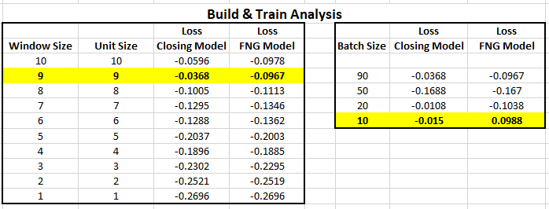
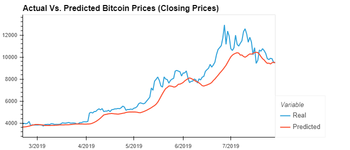
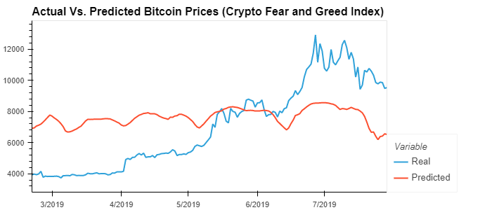

# LSTM_stock_predictor
LSTM Stock Predictor: Due to the volatility of cryptocurrency speculation, investors will often try to incorporate sentiment from social media and news articles to help guide their trading strategies. One such indicator is the Crypto Fear and Greed Index (FNG) which attempts to use a variety of data sources to produce a daily FNG value for cryptocurrency. You have been asked to help build and evaluate deep learning models using both the FNG values and simple closing prices to determine if the FNG indicator provides a better signal for cryptocurrencies than the normal closing price data. 

In this assignment, I will use deep learning recurrent neural networks to model bitcoin closing prices. One model will use the FNG indicators to predict the closing price while the second model will use a window of closing prices to predict the nth closing price.


## Preparing the Data for training and testing

In this section, the training and testing data for the model was prepared. The model uses a rolling 10 day window to predict the 11th day closing price.

Steps Taken:
1. Used the `window_data` function to generate the X and y values for the model.
2. Split the data into 70% training and 30% testing
3. Applied the MinMaxScaler to the X and y values
4. Reshaped the X_train and X_test data for the model. Note: The required input format used for the LSTM was:

```python
reshape((X_train.shape[0], X_train.shape[1], 1))
```

## Build and Train custom LSTM RNN's

In this section, I designed a custom LSTM RNN and fit (train) it using the training data.

Steps Taken:
1. Defined the model architecture
2. Compiled the model
3. Fit the model to the training data


The same model architecture and random seed was used for both notebooks. This was necessary to accurately compare the performance of the FNG model vs the closing price model. 

## Build & Train Analysis
By adjusting the Window Size and Unit Size from 10 down to 1 I concluded that the best outcome came from using 9.  With this new window & unit size of 9 I then proceeded to analyse which batch size worked best.  I concluded that a batch size of 10 seemed to work well.



## Evaluate the Performance of Each Model
After preparing, building, training and testing the two models the **"Closing Prices"** model would appear to be the most accurate at predicting the Bitcoin prices.  Taking in to account the loss (mean squared error) of both models the **"Closing Prices"** model once again was the most accurate.

